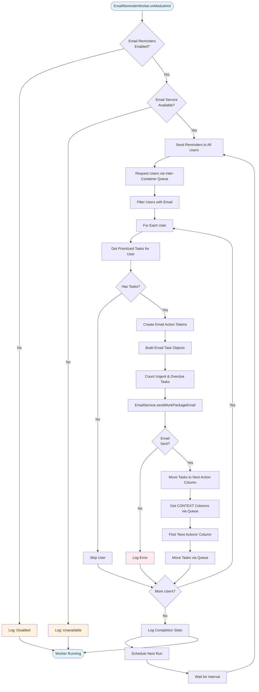
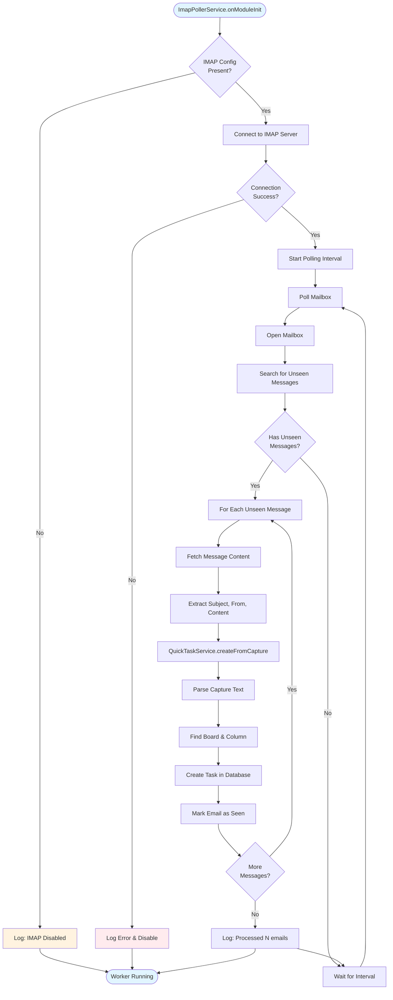
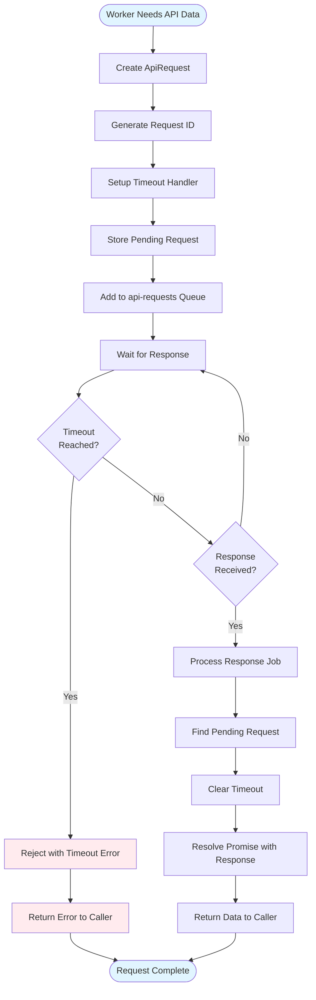
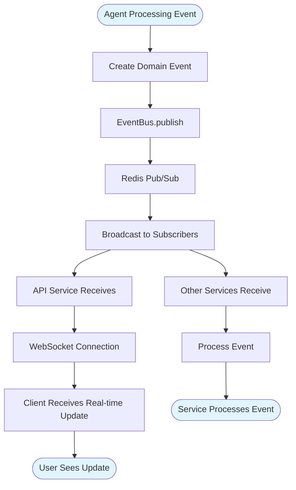

# Worker Service Flow Chart

This document contains visual flowcharts for the worker service operations.

## Main Agent Processing Flow

```mermaid
flowchart TD
    Start([API Service Creates Task]) --> Queue[Add Job to agent-processing Queue]
    Queue --> Processor[AgentJobProcessor.process]
    
    Processor --> Validate{Validate Job Data}
    Validate -->|Invalid| Error1[Log Error & Fail Job]
    Validate -->|Valid| FetchTask[Fetch Task from Database]
    
    FetchTask --> Process[TaskProcessorService.processTaskWithAgents]
    
    Process --> Orchestrate[AgentOrchestrator.processTask]
    
    Orchestrate --> FetchTaskData[Fetch Task Data]
    FetchTaskData --> SelectAgents[AgentSelectorAgent.selectAgents]
    
    SelectAgents --> CheckWebContent{Web Content<br/>Selected?}
    CheckWebContent -->|Yes| ExtractURL[Extract URL from Task]
    ExtractURL --> Download[WebContentAgent.downloadContent]
    Download --> CheckDownload{Download<br/>Success?}
    CheckDownload -->|No| LogError1[Log Error]
    CheckDownload -->|Yes| CheckLength{Content<br/>> 500 chars?}
    CheckLength -->|No| SkipSummarize[Skip Summarization]
    CheckLength -->|Yes| Summarize[ContentSummarizerAgent.summarize]
    Summarize --> TaskAssistant
    CheckWebContent -->|No| TaskAssistant
    SkipSummarize --> TaskAssistant
    LogError1 --> TaskAssistant
    
    TaskAssistant[TaskAssistantAgent.processTask]
    TaskAssistant --> Clarification[Clarification Phase]
    Clarification --> Structure[Structure Phase]
    Structure --> Implementation[Implementation Phase]
    Implementation --> QA[Quality Assurance Phase]
    
    QA --> CheckActions{Action Extraction<br/>Selected?}
    CheckActions -->|Yes| ExtractActions[ActionExtractorAgent.extractActions]
    ExtractActions --> CheckMeaningful{Has Meaningful<br/>Actions/Content?}
    CheckActions -->|No| CheckMeaningful
    
    CheckMeaningful -->|Yes| ProposeSolutions[SolutionProposerAgent.proposeSolutions]
    CheckMeaningful -->|No| CheckHelp
    
    ProposeSolutions --> CheckHelp{Has Substantial<br/>Content for Help?}
    CheckHelp -->|Yes| GenerateHelp[TaskHelpAgent.generateHelp]
    CheckHelp -->|No| ParallelAnalysis
    
    GenerateHelp --> ParallelAnalysis[Run Analysis Agents in Parallel]
    
    ParallelAnalysis --> TaskAnalysis{Task Analysis<br/>Selected?}
    TaskAnalysis -->|Yes| AnalyzeTask[TaskAnalyzerAgent.analyzeTask]
    TaskAnalysis -->|No| ContextExtraction
    
    AnalyzeTask --> ContextExtraction{Context Extraction<br/>Selected?}
    ContextExtraction -->|Yes| ExtractContext[ContextExtractorAgent.extractContext]
    ContextExtraction -->|No| CombineResults
    
    ExtractContext --> CombineResults[Combine All Results]
    
    CombineResults --> PublishComplete[Publish AgentCompletedEvent]
    PublishComplete --> ReturnResults[Return AgentProcessingResult]
    
    ReturnResults --> ApplyResults[AgentApplicationService.applyResultsToTask]
    
    ApplyResults --> CreateHints[HintService.createHintsFromResults]
    CreateHints --> UpdateTask[Update Task Fields]
    UpdateTask --> AddChecklist[Add Checklist Items]
    AddChecklist --> StoreMetadata[Store Processing Metadata]
    
    StoreMetadata --> Markdown[Convert Description to Markdown]
    Markdown --> SendResults[AgentResultSenderService.sendResult]
    
    SendResults --> ResultQueue[Add Job to agent-results Queue]
    ResultQueue --> End([API Service Receives Results])
    
    Error1 --> End
    
    style Start fill:#e1f5ff
    style End fill:#e1f5ff
    style Error1 fill:#ffebee
    style LogError1 fill:#ffebee
```

## Email Reminder Flow

## IMAP Integration Flow

## Inter-Container Communication Flow

## Event Publishing Flow

## Complete System Architecture

```mermaid
flowchart TB
    subgraph API["API Service"]
        APICreate[Create Task]
        APIQueue[Add to agent-processing Queue]
        APIReceive[Receive Results from agent-results Queue]
        APIWebSocket[WebSocket Server]
    end
    
    subgraph Worker["Worker Service"]
        subgraph JobProcessing["Job Processing"]
            Processor[AgentJobProcessor]
            TaskProcessor[TaskProcessorService]
        end
        
        subgraph Orchestration["Agent Orchestration"]
            Orchestrator[AgentOrchestrator]
            Selector[AgentSelectorAgent]
            WebContent[WebContentAgent]
            Summarizer[ContentSummarizerAgent]
            TaskAssistant[TaskAssistantAgent]
            ActionExtractor[ActionExtractorAgent]
            SolutionProposer[SolutionProposerAgent]
            TaskHelp[TaskHelpAgent]
            TaskAnalyzer[TaskAnalyzerAgent]
            ContextExtractor[ContextExtractorAgent]
        end
        
        subgraph Application["Result Application"]
            AppService[AgentApplicationService]
            HintService[HintService]
            Markdown[ToMarkdownAgent]
        end
        
        subgraph Background["Background Workers"]
            EmailWorker[EmailReminderWorker]
            IMAPPoller[ImapPollerService]
        end
        
        subgraph Communication["Communication"]
            InterContainer[InterContainerQueueService]
            EventBus[Redis Event Bus]
        end
        
        ResultSender[AgentResultSenderService]
    end
    
    subgraph Queues["BullMQ Queues"]
        AgentProcessing[agent-processing]
        AgentResults[agent-results]
        APIRequests[api-requests]
        APIResponses[api-responses]
    end
    
    subgraph Redis["Redis"]
        EventPubSub[Event Pub/Sub]
        QueueStorage[Queue Storage]
    end
    
    subgraph Database["PostgreSQL"]
        Prisma[(Prisma Database)]
    end
    
    APICreate --> APIQueue
    APIQueue --> AgentProcessing
    AgentProcessing --> Processor
    Processor --> TaskProcessor
    TaskProcessor --> Orchestrator
    
    Orchestrator --> Selector
    Selector --> WebContent
    Selector --> Summarizer
    Selector --> TaskAssistant
    Selector --> ActionExtractor
    Selector --> SolutionProposer
    Selector --> TaskHelp
    Selector --> TaskAnalyzer
    Selector --> ContextExtractor
    
    TaskProcessor --> AppService
    AppService --> HintService
    TaskProcessor --> Markdown
    AppService --> Prisma
    
    TaskProcessor --> ResultSender
    ResultSender --> AgentResults
    AgentResults --> APIReceive
    
    Orchestrator --> EventBus
    EventBus --> EventPubSub
    EventPubSub --> APIWebSocket
    
    EmailWorker --> InterContainer
    IMAPPoller --> Prisma
    InterContainer --> APIRequests
    InterContainer --> APIResponses
    
    AgentProcessing --> QueueStorage
    AgentResults --> QueueStorage
    APIRequests --> QueueStorage
    APIResponses --> QueueStorage
    
    style API fill:#e3f2fd
    style Worker fill:#f3e5f5
    style Queues fill:#fff3e0
    style Redis fill:#ffebee
    style Database fill:#e8f5e9
```

